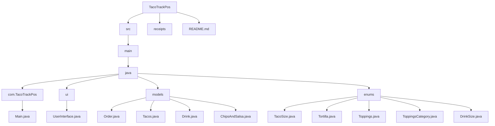
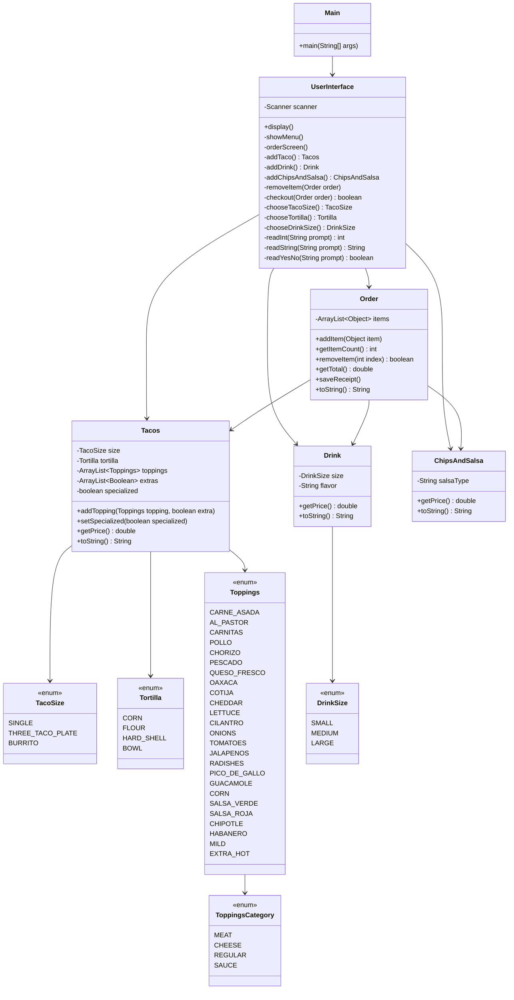

<div align="center">

# TacoTrack POS 

###  A Java Point-of-Sale Ordering System for a Taco Shop 🌮

<p>
  <span style="color:red;"><strong></strong></span> •
  <span style="color:white;"><strong></strong></span> •
  <span style="color:green;"><strong></strong></span>
</p>

```text
████████╗ █████╗  ██████╗ ██████╗
╚══██╔══╝██╔══██╗██╔════╝██╔═══██╗
   ██║   ███████║██║     ██║   ██║
   ██║   ██╔══██║██║     ██║   ██║
   ██║   ██║  ██║╚██████╗╚██████╔╝
   ╚═╝   ╚═╝  ╚═╝ ╚═════╝ ╚═════╝
        T A C O T R A C K   P O S


# TacoTrack POS

TacoTrack POS is a Java console-based point of sale application for a custom taco truck/shop. The application allows customers to view the menu, create a taco/burrito order, add drinks, add chips and salsa, remove items, checkout, and save a receipt.

## Project Description
This shop currently takes orders on paper. This application helps automate that process by allowing customers to build custom taco orders through a menu-driven Java program.

Customers can order:

- Single tacos
- 3-taco plates
- Burritos
- Drinks
- Chips & salsa

Customers can also choose tortillas, toppings, sauces, premium toppings, extra toppings, and whether the item is specialized.

## Features

- View menu before ordering
- Start a new order
- Add tacos or burritos
- Choose shell/tortilla
- Choose taco size
- Add meats
- Add cheese
- Add regular toppings
- Add sauces
- Add drinks
- Add chips & salsa
- Remove items before checkout
- View order total
- Confirm or cancel checkout
- Save receipt files in a `receipts` folder

## Application Screens

### Home Screen

```text
1) View Menu
2) New Order
0) Exit
```

### Order Screen

```text
1) Add Taco/Burrito
2) Add Drink
3) Add Chips & Salsa
4) Checkout
5) Remove Item
0) Cancel Order
```

### Add Item Screen

The add item screen asks the user to choose:

- Shell/tortilla
- Item size
- Meat toppings
- Premium toppings
- Other toppings
- Sauces
- Whether the item is specialized

### Checkout Screen

The checkout screen displays:

- All ordered items
- Item prices
- Total price
- Confirm or cancel option

## Folder Structure

```text
TacoTrackPos/
│
├── src/
│   └── main/
│       └── java/
│           │
│           ├── com/
│           │   └── TacoTrackPos/
│           │       └── Main.java
│           │
│           ├── ui/
│           │   └── UserInterface.java
│           │
│           ├── models/
│           │   ├── Order.java
│           │   ├── Tacos.java
│           │   ├── Drink.java
│           │   └── ChipsAndSalsa.java
│           │
│           └── enums/
│               ├── TacoSize.java
│               ├── Tortilla.java
│               ├── Toppings.java
│               ├── ToppingsCategory.java
│               └── DrinkSize.java
│
├── receipts/
│
└── README.md
```

## Folder Setup Diagram



## Class Diagram



## How To Run

1. Open the project in IntelliJ.
2. Make sure the project folder is opened at the `TacoTrackPos` root.
3. Go to:

```text
src/main/java/com/TacoTrackPos/Main.java
```

4. Run the `Main` class.

## Receipt Files

When a customer confirms an order, the application creates a receipt file inside the `receipts` folder.

Receipt files are named using the date and time:

```text
yyyyMMdd-HHmmss.txt
```

Example:

```text
20260529-091530.txt
```

## Pricing

### Base Prices

| Item | Price |
|---|---:|
| Single Taco | $3.50 |
| 3-Taco Plate | $9.00 |
| Burrito | $8.50 |

### Premium Toppings

| Topping Type | Single | 3-Taco | Burrito |
|---|---:|---:|---:|
| Meat | $1.00 | $2.00 | $3.00 |
| Extra Meat | $0.50 | $1.00 | $1.50 |
| Cheese | $0.75 | $1.50 | $2.25 |
| Extra Cheese | $0.30 | $0.60 | $0.90 |

### Other Products

| Item | Price |
|---|---:|
| Small Drink | $2.00 |
| Medium Drink | $2.50 |
| Large Drink | $3.00 |
| Chips & Salsa | $1.50 |

## OOP Concepts Used

This project uses object-oriented programming concepts:

- Classes to represent order items
- Enums to store fixed menu options
- Encapsulation with private fields and public methods
- Methods to separate user interface logic, pricing logic, and receipt logic
- Multiple objects working together to build a complete order
